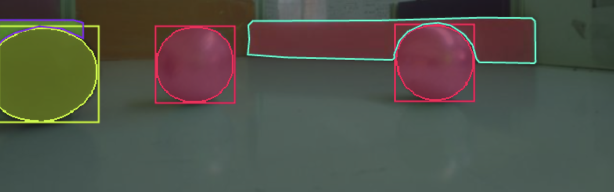

# Real-Time Ball Detection and Autonomous Targeting System  
Raspberry Pi + YOLO + ESP32

---

## Overview

This project implements a real-time computer vision and control system for an autonomous robot, designed for robotics competitions such as evacuation and rescue challenges.

The system runs on a Raspberry Pi 5, using a custom-trained YOLO model to detect and classify target objects (balls), and communicates with an ESP32 microcontroller to guide robot movement in real time.

---

## Key Capabilities

- Real-time object detection using YOLO (Ultralytics)
- Multi-class classification: Black, Green, Red, Silver balls
- Dynamic target prioritisation controlled by ESP32
- Direction estimation: Left, Middle, Right
- Lightweight and efficient embedded performance
- UART communication between Raspberry Pi and ESP32
- Modular and scalable system architecture

---

## System Architecture

```
Camera (PiCamera2)
        ↓
Calibration (Brightness + Color Correction)
        ↓
YOLO Detection (Raspberry Pi)
        ↓
Target Filtering and Selection
        ↓
Direction Decision (Left / Middle / Right)
        ↓
UART Communication
        ↓
ESP32 → Robot Movement
```

---

## Communication Protocol

### ESP32 to Raspberry Pi
```
T,s → Detect Silver
T,b → Detect Black
T,g → Detect Green
T,r → Detect Red
T,n → No target
```

### Raspberry Pi to ESP32
```
D,l → Target on left
D,m → Target in middle
D,r → Target on right
D,n → No detection
```

---

## How It Works

1. The camera captures live frames using Picamera2  
2. Frames are preprocessed:
   - Gamma correction for brightness normalization  
   - LAB-based color calibration  
3. The lower region of the frame is selected as the Region of Interest (ROI) for efficiency  
4. YOLO performs object detection  
5. The system filters detections based on the requested target class  
6. The closest object is selected using bounding box area  
7. The object position is mapped to Left, Middle, or Right  
8. The direction is sent to the ESP32 for robot control  

---

## Project Structure

```
.
├── main_yolo.py
├── main.py
├── capture_main.py
├── camera.py
├── calibration.py
├── detector.py
├── visual.py
├── serial_protocol.py
├── config.py
├── esp32/
│   └── serial_parser.c
├── legacy/
│   └── esp_serial.py
```

---

## Technologies Used

```
- Python  
- OpenCV  
- NumPy  
- Ultralytics YOLO  
- Picamera2 / libcamera  
- UART Serial Communication  
- C++ (ESP32 firmware)  
```

---

## Running the Project

### Install dependencies
```bash
pip install -r requirements.txt
```

### Run the system
```bash
python main_yolo.py --show
```

### Capture dataset
```bash
python capture_main.py
```

---

## Development Approach

### Stage 1 — Classical Computer Vision
```
HSV thresholding
Morphological filtering
Contour detection
Circularity checks
Highlight validation
```

### Stage 2 — Deep Learning
```
Dataset collection
Model training using YOLO
Real-time inference
```

### Stage 3 — Embedded Integration
```
UART communication protocol
ESP32 integration
Closed-loop control
```

---

## Performance

```
10 to 25 FPS depending on model and configuration
```

---

## Model Weights

Place your trained model file at:

```
weights/ball_yolo26_best.pt
```

---

## Demo



---

## Notes

- Model weights are not included in this repository due to size limitations.
- You must provide your own trained YOLO model to run the system.

---

## Author

Sepehr Kalantari Soltanieh